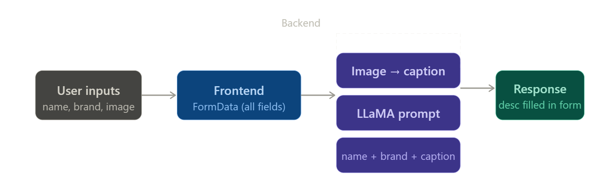

# 🛒 MERN E-Commerce Platform with AI Capabilities

A production-oriented **full-stack E-Commerce application** built using the **MERN stack (MongoDB, Express.js, React, Node.js)**. The system integrates **secure payment processing, AI-powered product discovery, and scalable backend architecture**, reflecting real-world product engineering practices.

---

## 🚀 Core Features

### User Functionality

* JWT-based Authentication & Authorization
* Product Browsing & Detail View
* Keyword-based Product Search (MongoDB queries)
* Cart Management (Add/Remove/Update)
* Custom Collections (logical grouping of cart items)
* Secure Checkout via Stripe
* Order History Tracking
* User Profile Management

---

### Admin Functionality

* Role-based Admin Access
* Product CRUD Operations
* AI-generated Product Descriptions
* Order Monitoring & Management
* User Management

---

### AI & Search Capabilities

* AI-based Image Search for product discovery
* Embedding generation using Transformers
* Vector similarity search via Pinecone
* Context-aware product recommendations

---

## 🧱 System Architecture

### Frontend

* React (Vite-based build system)
* Tailwind CSS (utility-first styling)
* Axios (API communication layer)
* React Router (client-side routing)
* Custom Hooks (Auth & Cart state management)

### Backend

* Node.js + Express.js (REST API layer)
* MongoDB + Mongoose (data modeling)
* JWT (stateless authentication)
* Stripe (payment processing)
* Multer (file handling middleware)

### AI Layer

* HuggingFace / Transformers (embedding generation)
* Pinecone (vector database for semantic search)




---

## 📁 Project Structure

```
Backend/
  ├── config/        # Database & environment configs
  ├── controller/    # Business logic layer
  ├── middleware/    # Auth, upload, error handling
  ├── model/         # Mongoose schemas
  ├── router/        # API route definitions
  ├── services/      # External services (Stripe, AI)
  └── server.js      # Entry point

frontend/
  ├── src/
  │   ├── components/  # Reusable UI components
  │   ├── pages/       # Route-level pages
  │   ├── hooks/       # Custom hooks
  │   └── services/    # API abstraction layer
```

---

## ⚙️ Setup & Execution

### Clone Repository

```bash
git clone https://github.com/your-username/ecommerce-project.git
cd ecommerce-project
```

---

### Backend Configuration

```bash
cd Backend
npm install
npm run dev
```

Create `.env` file:

```
PORT=5000
MONGO_URI=<MongoDB Atlas URI>
JWT_SECRET=<JWT Secret Key>
STRIPE_SECRET_KEY=<Stripe Secret Key>
PINECONE_API_KEY=<Pinecone API Key>
```

---

### Frontend Configuration

```bash
cd frontend
npm install
npm run dev
```

---

## 💳 Payment Workflow (Stripe Integration)

1. Client initiates checkout
2. Backend creates Stripe session
3. User completes transaction via Stripe UI
4. Payment status handled (success/cancel routes)
5. Order persisted in MongoDB

---

## 🔍 Search & AI Workflow

* Standard Search → MongoDB query with filters
* AI Search →

  * Input processed into embeddings
  * Stored/searched via Pinecone
  * Returns semantically relevant products

---

## 🌐 Deployment Strategy

* Frontend: Vercel (static hosting + CDN)
* Backend: Render / Railway (Node service)
* Database: MongoDB Atlas (cloud database)

---

## 📈 Scalability Considerations

* Modular service layer (Payment, AI)
* Middleware-based request handling
* Stateless authentication (JWT)
* Separation of concerns (MVC pattern)

---

## 📌 Future Enhancements

* Product Reviews & Ratings System
* Wishlist Module
* Pagination & Lazy Loading
* Email Notifications (Order updates)
* Stripe Webhooks for robust payment validation

---

## 👨‍💻 Author

**Mona**
Full Stack Developer (MERN, Java, React Native)

---

## ✅ Summary

This project demonstrates:

* End-to-end full-stack development
* Secure payment integration (Stripe)
* AI-driven search and recommendation system
* Scalable backend architecture

